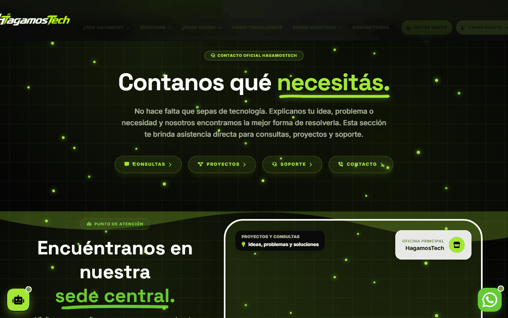
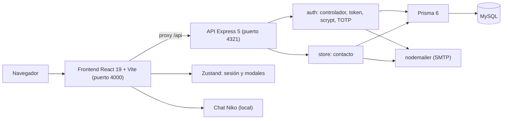
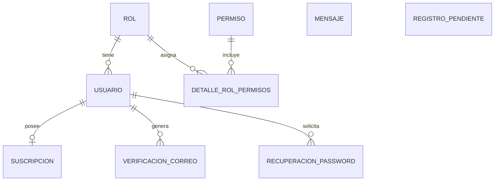

<div align="center">
  
  <h1>HagamosTech</h1>
  <p><b>Sitio web y API de una agencia de soluciones digitales: catálogo de servicios, contacto, cuentas con 2FA y un asistente de chat.</b></p>
  
  
  
  
  
  
  
  <br/>
  <a href="https://github.com/Luiss2080/HagamosTech/actions/workflows/ci.yml"></a>
  <p>
    <a href="#-inicio-rápido">Inicio rápido</a> ·
    <a href="#-características">Características</a> ·
    <a href="#-arquitectura">Arquitectura</a> ·
    <a href="#-pruebas">Pruebas</a> ·
    <a href="#-lo-que-todavía-no-existe">Limitaciones</a>
  </p>
</div>

**HagamosTech** es la web de una agencia de soluciones tecnológicas (estudiantes, emprendedores, empleo, diseño, web,
software, IA y trabajos a medida). Incluye un frontend React con el catálogo de servicios, un backend Express/Prisma
para cuentas y mensajes de contacto, y un asistente de chat local. **No es una tienda online**: no hay carrito ni
pagos (esos endpoints responden `410 Gone`), y el catálogo es informativo; la contratación se canaliza por contacto.

## 🎬 Vista rápida

Capturas reales del frontend en modo desarrollo (Chrome headless, 1280x800).

<div align="center">
  
  
</div>

## ✨ Características

| Característica | Detalle |
|---|---|
| Catálogo de servicios | 8 categorías y 35 servicios definidos en `src/data/serviciosData.js` (estudiantes 6, emprendedores 6, empleo 6, diseño 5, web 5, software 3, IA 3, a medida 1). Es la fuente única de datos del frontend. |
| Páginas | Inicio, Qué hacemos, Servicios (8 páginas), Cómo trabajamos, Sobre nosotros, Promociones, Novedades, Contacto, páginas legales, errores 401/403/404/419/500. Rutas con `HashRouter` y carga diferida. |
| Contacto | `POST /api/contacto` guarda el mensaje en MySQL y notifica por correo (SMTP con nodemailer) sin bloquear la respuesta. |
| Cuentas | Registro con código de verificación por correo, login, recuperación y restablecimiento de contraseña. Contraseñas con `scrypt`. Token firmado HMAC-SHA256 de 7 días (implementación propia, sin librería JWT). |
| 2FA | TOTP (RFC 6238, compatible con Google Authenticator) implementado en `server/auth/utils/totp.js`. |
| Perfil | Ver/editar perfil, cambiar contraseña, exportar datos, desactivar cuenta. |
| Asistente "Niko" | Chat flotante con procesamiento de lenguaje local (`src/chat`); no llama a ninguna API externa. |
| WhatsApp | Utilidad `src/utils/whatsapp.js` y botón flotante. |

## 🏗️ Arquitectura





<details>
<summary>Estructura de carpetas</summary>

```
HagamosTech/
├── src/
│   ├── app/            # App.jsx (rutas), main.jsx, seo.js
│   ├── pages/          # Inicio, Servicios, Contacto, Perfil, legales, errores...
│   ├── components/     # Layout, Modales, Widgets, ui, fondos...
│   ├── chat/           # Asistente Niko (NLP local)
│   ├── data/           # serviciosData.js
│   ├── servicios/      # clienteApi.js, servicioContacto.js
│   └── store/          # useAutenticacionStore, useModalStore
├── server/
│   ├── server.js       # Express; monta /api/auth, /api/contacto, /api/perfil...
│   ├── auth/           # controllers, routes, utils (token, password, totp, mailer)
│   ├── store/routes/   # contactoRoutes.js
│   ├── prisma/         # schema.prisma (MySQL) y seed.js
│   └── test/           # tests con Prisma mockeado
├── e2e/                # Playwright (auth, chat, humo, paginas)
├── specs/              # Especificaciones SDD por feature
├── docs/               # constitución, catálogo, diagnóstico, testing
└── .github/workflows/  # ci.yml
```

</details>

## 🚀 Inicio rápido

| Requisito | Versión |
|---|---|
| Node.js | 18+ (el CI usa 20) |
| MySQL | 8.x (para el backend con datos reales) |
| Puertos | 4000 (frontend) y 4321 (API) por defecto |

1. Instala dependencias del frontend y del backend:
   ```bash
   npm install
   cd server && npm install && cd ..
   ```
2. Crea `server/.env` con al menos `DATABASE_URL` (MySQL) y `JWT_SECRET`; opcional `PORT`, `FRONTEND_URL` y `SMTP_*` (ver el desplegable de variables).
3. Crea las tablas y los datos semilla:
   ```bash
   cd server && npx prisma db push && npm run db:seed && cd ..
   ```
4. Levanta todo (o solo el frontend con `npm run dev`; las pantallas estáticas funcionan sin backend):
   ```bash
   npm run dev:all
   ```
   Frontend en `http://localhost:4000`. El frontend llama a `/api` mediante el proxy de Vite; si no defines `VITE_API_PROXY_TARGET` el proxy apunta a `http://localhost:3001`, así que define `VITE_API_PROXY_TARGET=http://localhost:4321` (según `docs/testing.md` y `docs/diagnostico.md`).

<details>
<summary>Variables de entorno del backend (nombres, sin valores)</summary>

`DATABASE_URL`, `PORT`, `NODE_ENV`, `JWT_SECRET`, `FRONTEND_URL`, `SMTP_HOST`, `SMTP_PORT`, `SMTP_SECURE`,
`SMTP_USER`, `SMTP_PASS`, `SMTP_FROM`. El backend prueba hasta 3 puertos consecutivos si `PORT` está ocupado.
`npm run build` genera el sitio estático con `base: './'`.

</details>

<details>
<summary>Scripts principales</summary>

| Comando | Descripción |
|---|---|
| `npm run dev` | Frontend con Vite (puerto 4000) |
| `npm run dev:server` | Backend Express con nodemon |
| `npm run dev:all` | Ambos en paralelo (`concurrently`) |
| `npm run build` | Build de producción |
| `npm run lint` | ESLint |
| `npm run test:run` | Vitest del frontend (una pasada) |
| `npm run test:e2e` | Playwright |
| `cd server && npm run test:run` | Vitest del backend |

</details>

## 🧪 Pruebas

Ejecutadas al preparar este README: `npm run lint` (0 errores, 5 avisos de `react-hooks/exhaustive-deps`),
`npm run test:run` (**28 tests**, 5 archivos) y `cd server && npm run test:run` (**24 tests**, 6 archivos) pasan.
Cubren catálogo de datos, SEO, NLP del chat, contenido y smoke del frontend; y en backend contacto, mailer, contraseñas,
tokens y perfil con Prisma mockeado (no prueban MySQL real). Hay 4 specs E2E de Playwright (no ejecutadas aquí) y
un workflow de CI (`ci.yml`) con jobs de calidad y E2E.

## 🔒 Seguridad

Implementado: hash `scrypt`, comparación en tiempo constante, tokens con expiración, 2FA TOTP, JSON malformado
responde 400, CORS restringido a orígenes conocidos, endpoints inexistentes responden 404 y los retirados 410.
`GET /api/contacto` y `PUT /api/contacto/:id/estado` exigen sesión y rol de administrador (401 sin sesión, 403 sin rol; el estado se valida contra `nuevo|leido|respondido|archivado`); solo `POST /api/contacto` es público.

<details>
<summary>Avisos importantes para quien despliegue</summary>

- `server/.env.production` estuvo versionado (con un usuario SMTP y entradas de base de datos y JWT). Ya no se
  versiona (se ignora y hay una plantilla sin valores en `server/.env.example`), pero sigue en el historial de git:
  trata esos valores como expuestos y rota las credenciales (`DATABASE_URL`, `JWT_SECRET`, `SMTP_USER`, `SMTP_PASS`).
- `JWT_SECRET` es obligatorio en producción (`NODE_ENV=production`): sin él el backend no arranca. Solo en desarrollo/tests se usa un valor de prueba. El token legado `token-user-<id>-<ts>` ya no se acepta.
- No hay límite de peticiones (rate limit) ni bloqueo por intentos fallidos, aunque el esquema tiene columnas para ello.

</details>

## 🚧 Lo que todavía no existe

- Panel de administración: hay roles y permisos en base de datos, pero ninguna pantalla ni endpoint protegido para gestionar mensajes o usuarios.
- Compras, carrito y pagos: retirados (`410`); la página `HistorialComprasPagina` y el hook `useComprasPerfil` siguen en el frontend apuntando a `/compras/*`, que ya no existe.
- Sesiones múltiples: `GET /api/perfil/sessions` devuelve siempre una lista vacía y revocar responde 404.
- Límite de peticiones y bloqueo de cuenta (ver Seguridad).
- El README anterior citaba `public/img/01_Layout/logo.png`, que no existe en el repositorio (imagen rota); corregido aquí.
- `public/` versiona solo 4 imágenes; no se auditó si otras páginas referencian imágenes que faltan en un clon limpio.
- El catálogo "Personalizado" tiene un solo servicio y las cifras de marketing de la web (p. ej. "+500 estudiantes") no provienen de datos del sistema.
- `.playwright-mcp/` (volcados de páginas) está versionado por descuido.

## 📄 Licencia

[MIT](LICENSE) — © 2026 Luis Rocha.

<div align="center">
  <sub>Hecho por Luiss2080 · React + Express + Prisma</sub>
</div>
